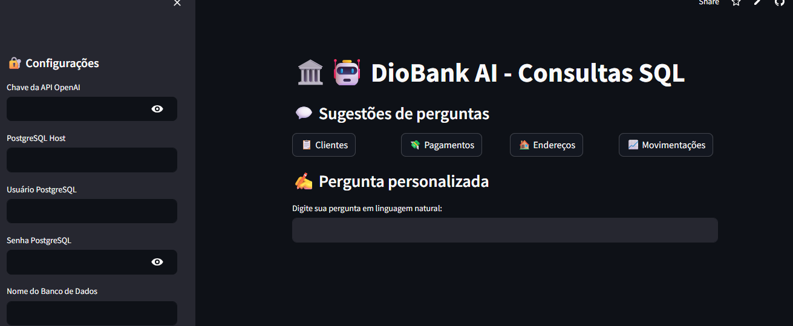

# Projeto desenvolvido no Evento da DIO: Community Week - AI Agentes

# <div align="center">
  
</div>

<div align="center">
  <h2>🛠️ Assistente de Consultas SQL com IA + PostgreSQL no Supabase</h2>
</div>

---

### **Tela do App**


- Link do App no Streamlit: https://auladioagentessq-wghwgk7esvbt6jm4ti8dt7.streamlit.app/

## 🔌 **Configuração Inicial**

### 1. Variáveis de Ambiente (`.env`)

```bash
# Supabase
POSTGRE_DB_HOST=aws-0-..
POSTGRE_DB_NAME=postgres
POSTGRE_DB_USER=postgres...
POSTGRE_DB_PASSWORD=****
POSTGRE_DB_PORT=6543
```

* Acesse as configurações do Postgres na pasta baco de dados.

```bash
# OpenAI
OPENAI_API_KEY=sk-...

2. Estrutura de Pastas

├── aula_dio_agentes_sq/
│   ├── agentes/scripts          
│   ├── streamlit_agente.py 
    └── terminal_agente.py 
```

🚀 Como Executar

# Instalar dependências
```bash
pip install -r requirements.txt
```
# Iniciar aplicação
```bash
streamlit run agente/scripts/streamlit_agent.py
```
## 📦 Dependências do Projeto

O projeto utiliza as seguintes bibliotecas Python:

```python
streamlit==1.29.0          # Framework para interface web
openai==0.28.0             # Integração com a API da OpenAI
python-dotenv==1.0.0       # Gerenciamento de variáveis de ambiente
faker==19.6.2              # Geração de dados fictícios para testes
psycopg2-binary==2.9.9     # Adaptador PostgreSQL para Supabase (versão leve)
```
<p align="left">     </p>


# Objetivo do Projeto:

- Construa um Agente que entende e responde com consultas SQL perfeitas, usando linguagem natural, sem precisar digitar queries complexas!
Nesta live com Maycon Cipriano, especialista de IA, você vai desenvolver um Agente de IA que irá otimizar seu tempo, simplificando consultas em bancos MySQL(adaptei para postgreSQL), gerando insights poderosos sem escrever códigos longos e demorados.

# Referências:

##  Professor:

### Maycon Cipriano

Especialista em IA

Especialista em IA generativa e PLN com foco em WatsonX. Lidera a maior comunidade técnica da IBM no Brasil (OIC Brazil Chapter).


### Pefil: [](https://www.linkedin.com/in/mayconbatestin/)
### Link da aula: [](https://www.youtube.com/watch?v=336Zf7XfG2U&t=4701s)

Link Da DIO: https://www.dio.me/
##  Meus Contatos:

### Pefil: [](https://www.linkedin.com/in/mayconbatestin/)

[](https://wa.me/5577999272367)
